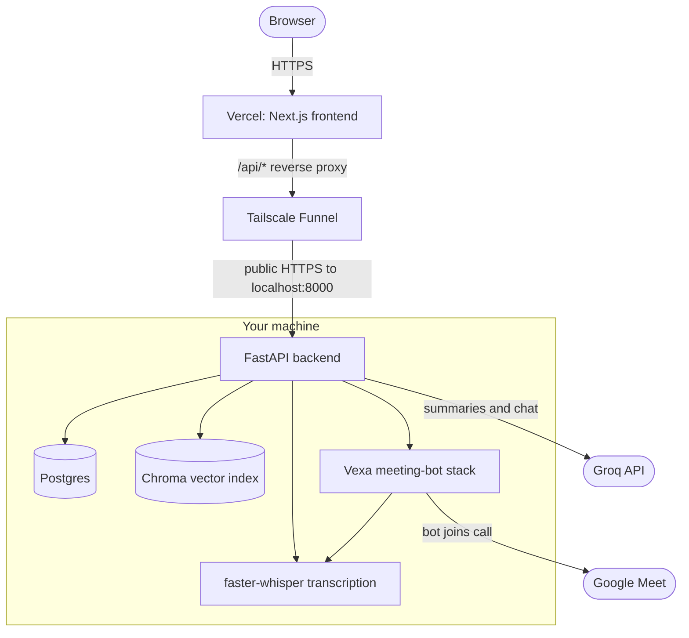
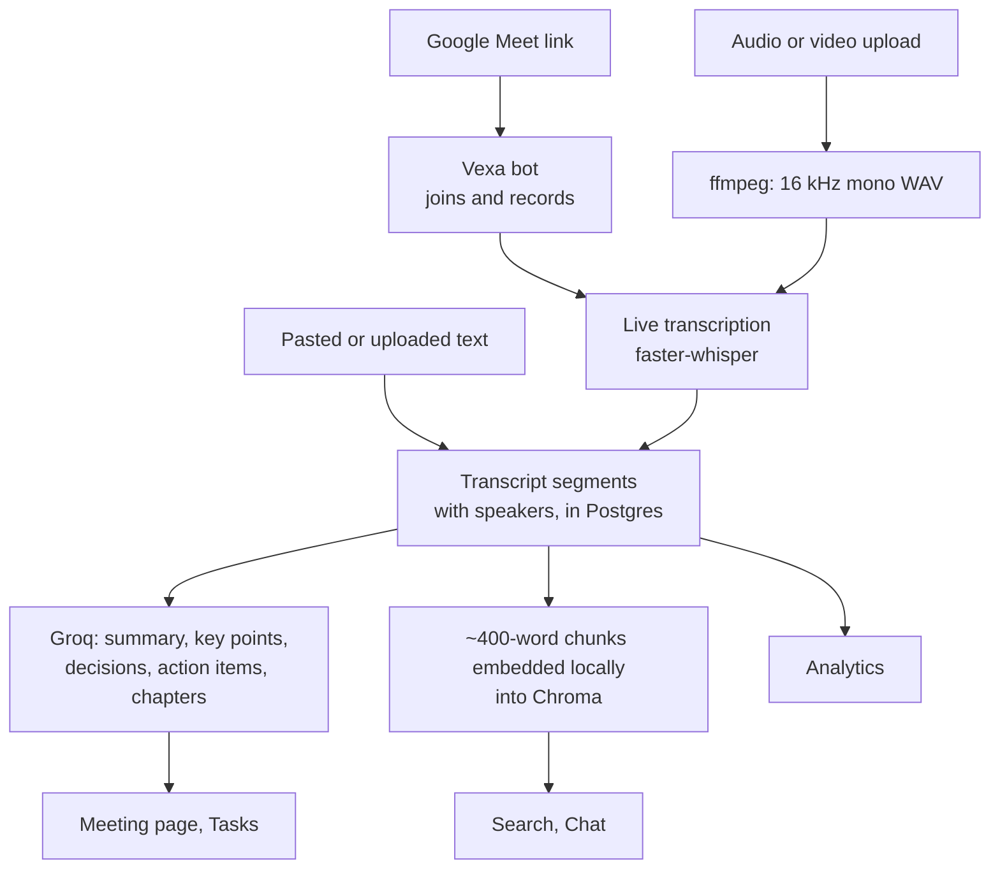

# Meetscribe

**A free, self-hosted alternative to Fireflies.ai.** Send a bot into a Google Meet call, or upload a recording, and get a speaker-labelled transcript, an AI summary with action items, full-text search, and a chat assistant that answers questions across all of your meetings. No per-seat pricing and no per-hour transcription bill.


**Live app:** <https://frontend-zeta-brown-62.vercel.app> - registration is invite-only, so you need an invite link from the author. The backend runs on the author's own machine behind Tailscale Funnel, so the app is up whenever that machine is on and online (see [Deployment](#deployment)).

---

## Features

**Capture**
- **Live meeting bot** - paste a Google Meet link and a bot joins, records and transcribes the call. Status is tracked by a background poller, with a manual *End Recording* button.
- **Upload File** - drop in audio (`.mp3 .wav .m4a .ogg`) or video (`.mp4 .mov .webm`) up to 1 GiB and it is transcribed locally. Text transcripts (`.txt .md`) can be imported too.
- **Speaker labels** - transcripts are split by speaker, and participants can be renamed per meeting.

**Understand**
- **AI summaries** - one structured Groq call per meeting returns a summary, key points, decisions, action items and timestamped chapters.
- **Action items** - a cross-meeting Tasks page, grouped by meeting, with completion tracking and full create / edit / delete.
- **Analytics** - talk-time per participant for each meeting and in aggregate.

**Find**
- **Search** - keyword search across every transcript, filtered by date range and participant, with highlighted snippets.
- **Chat with your meetings** - ask a question in plain English and get an answer grounded *only* in your own meetings, with source chips linking to the meetings it drew from (retrieval-augmented generation).

**Review**
- **Audio playback synced to the transcript**, with click-to-seek and in-transcript search.
- Editable meeting titles, light / dark / system theme.

**Accounts**
- Multi-user with strict per-user data isolation, invite-code registration, session cookies, profile and password management, and account deletion that removes everything (database rows, vector embeddings and the bot-side recordings).

---

## How it works



Every meeting, however it arrives, ends up as the same set of rows, so everything downstream treats it the same way:



Meeting join and audio capture are handled by a self-hosted [Vexa](https://github.com/Vexa-ai/vexa) instance (Apache 2.0), included as a git submodule pinned to a tested commit. Transcription runs on a separately self-hosted `faster-whisper` service on local GPU hardware, not a hosted API, which keeps the whole stack free. This repository is everything built on top of that: the API, dashboard, summarization, search and chat.

## Tech stack

| Layer | Technology |
|---|---|
| Frontend | Next.js 16 (App Router), React 19, TypeScript, Tailwind CSS 4, Recharts, next-themes |
| Backend | FastAPI, SQLAlchemy 2, Alembic, APScheduler, httpx, Python 3.12 |
| Data | PostgreSQL 17 (Docker), Chroma (embedded vector store) |
| AI | Groq (`openai/gpt-oss-120b`) for summaries and chat, `multi-qa-MiniLM-L6-cos-v1` (sentence-transformers) for local embeddings, `faster-whisper` for speech-to-text |
| Meeting bot | [Vexa](https://github.com/Vexa-ai/vexa), self-hosted (a git submodule pointing at [our fork](https://github.com/Nishtha027/vexa)) |
| Auth | bcrypt password hashing, signed JWT in an HTTP-only session cookie (7 days) |
| Hosting | Vercel (frontend), Tailscale Funnel to a self-hosted backend |

## Engineering highlights

- **Per-user isolation, end to end.** Every query is scoped to the signed-in user, including the vector search that powers Chat, so one user's meetings can never be retrieved for another. Deleting a meeting also refuses to remove a bot-side recording that another meeting still references.
- **Login that works in every browser.** The backend and frontend are different sites, which makes the session cookie a third-party cookie, and Safari, iOS and Brave block those. In production Vercel reverse-proxies `/api/*` to the backend so the cookie is first-party everywhere. The direct cross-origin mode (`SameSite=None; Secure` plus an explicit CORS allowlist) is still supported.
- **Found and fixed a multi-worker bug.** Embedded Chroma is single-process, so with two uvicorn workers about half of `/chat` calls failed because each worker cached its own copy of the index. The backend now runs one worker on purpose, with the reasoning documented, and the background poller is guarded by an OS file lock so it can never run twice.
- **Abuse protection on public endpoints.** A sliding-window limiter on `/auth/login` and `/auth/register` (per email, per IP and global) returns `429` with `Retry-After`. Invite links carry the code in the URL *fragment*, which browsers never send to any server, and the page strips it from the address bar after reading it.
- **Robust transcription input.** The transcription service only decodes 16 kHz mono WAV and M4A reliably, and returned empty text for MP3 and other WAV rates. Every upload is normalised with ffmpeg to 16 kHz mono WAV first, and the common formats were verified end to end through the real UI.
- **Resilient to a flaky host.** The database pool pings connections before use and recycles them, so the backend rides out a Postgres container restart without needing its own.
- **Careful with real data.** [docs/TESTING_GUIDELINES.md](docs/TESTING_GUIDELINES.md) records an incident where a disposable test account was mirrored onto a real meeting's identifiers and cleanup destroyed a real recording, along with the rule and code changes that prevent a repeat.

## Getting started (local development)

**Prerequisites:** Docker Desktop, Python 3.12, Node.js 20.9+ (developed on 22), a free [Groq API key](https://console.groq.com), and `ffmpeg` on your `PATH` (for audio/video uploads). A CUDA GPU is recommended for the transcription service.

**1. Clone with the Vexa submodule**

```bash
git clone --recurse-submodules https://github.com/Nishtha027/fireflies-meeting-bot.git
cd fireflies-meeting-bot
```

**2. (Optional) Start the bot and transcription stack.** Needed for live capture and audio/video uploads: follow [docs/VEXA_SETUP.md](docs/VEXA_SETUP.md). You can skip it to try the app, because pasted or uploaded text transcripts only need steps 3 and 4 plus your Groq key.

**3. Backend**

```bash
cd backend
cp .env.example .env          # then fill in the values (see Configuration below)
docker compose up -d          # the app's own Postgres on 127.0.0.1:5433
python -m venv venv
source venv/bin/activate      # Windows: venv\Scripts\activate
pip install -r requirements.txt
alembic upgrade head          # create the schema
uvicorn main:app --reload --port 8000
```

The API is now at <http://localhost:8000>, with interactive docs at `/docs`. The embedding model (~90 MB) downloads on first use.

**4. Frontend**

```bash
cd frontend
npm install
npm run dev
```

No frontend configuration is needed locally: it calls the backend at `http://localhost:8000` by default. Open <http://localhost:3000/register> and create an account using the `INVITE_CODE` you set in `backend/.env`.

## Configuration

**Backend** (`backend/.env`, template in [`backend/.env.example`](backend/.env.example))

| Variable | Purpose |
|---|---|
| `POSTGRES_USER` `POSTGRES_PASSWORD` `POSTGRES_DB` `POSTGRES_HOST_PORT` | The app's own Postgres. Keep it separate from Vexa's database. |
| `GROQ_API_KEY` | Summaries and chat. |
| `JWT_SECRET_KEY` | Signs session tokens. Generate your own: `python -c "import secrets; print(secrets.token_hex(32))"` |
| `INVITE_CODE` | The one shared code required to register. Use a long random value: `python -c "import secrets; print(secrets.token_urlsafe(16))"` |
| `VEXA_API_BASE` `VEXA_API_KEY` | Your self-hosted Vexa gateway. |
| `TRANSCRIPTION_SERVICE_URL` `TRANSCRIPTION_SERVICE_TOKEN` | The self-hosted faster-whisper service used for uploads. |
| `FFMPEG_PATH` | Only if `ffmpeg` isn't already on `PATH`. |
| `COOKIE_SECURE` `COOKIE_SAMESITE` | `false` / `lax` for local dev, `true` / `none` for cross-origin production. |
| `CORS_ORIGINS` | Comma-separated exact origins allowed to call the API directly. |

**Frontend** (`frontend/.env.local` locally, Vercel project env in production)

| Variable | Purpose |
|---|---|
| `NEXT_PUBLIC_API_URL` | Defaults to `http://localhost:8000`. Set to `/api` in production (proxy mode). |
| `API_PROXY_TARGET` | Production only: the backend URL that Vercel forwards `/api/*` to. Leave unset locally. |

## API overview

All endpoints except `/health` and `/auth/*` require the session cookie. Full, interactive reference at `/docs` when the backend is running.

| Area | Endpoints |
|---|---|
| Auth | `POST /auth/register` `/auth/login` `/auth/logout`, `GET /auth/me` |
| Meetings | `GET /meetings`, `GET /meetings/{id}`, `PATCH /meetings/{id}`, `DELETE /meetings/{id}`, `GET /meetings/participants` |
| Capture | `POST /meetings/start`, `GET /meetings/{id}/capture-status`, `POST /meetings/{id}/stop-recording` |
| Ingest | `POST /meetings/upload`, `POST /meetings/manual`, `POST /meetings/{id}/ingest`, `POST /meetings/{id}/summarize`, `POST /meetings/{id}/embed`, `POST /embed-all` |
| Detail | `GET /meetings/{id}/audio` (HTTP Range supported), `GET /meetings/{id}/analytics`, `PATCH /meetings/{id}/participants` |
| Tasks | `GET /action-items`, `POST /meetings/{id}/action-items`, `PATCH` / `DELETE /action-items/{id}` |
| Insights | `GET /search`, `POST /chat`, `GET /analytics/overview` |
| Settings | `PATCH /settings/account`, `POST /settings/change-password`, `POST /settings/delete-account` |

## Project structure

```
backend/        FastAPI app: API routes (main.py), auth, summarization, embeddings,
                RAG chat, uploads, background poller, rate limiter, Alembic migrations
frontend/       Next.js app: pages, components, API client
docs/           DEPLOYMENT, VEXA_SETUP, TESTING_GUIDELINES, PHASES (project history)
scripts/        Production run / Windows-service helper scripts
vexa/           Self-hosted meeting-bot stack (git submodule)
archive/        The original hand-built Playwright bot, kept for reference
```

## Deployment

Production runs the frontend on Vercel and the backend on a home machine exposed by Tailscale Funnel (free, stable HTTPS, no port forwarding). [docs/DEPLOYMENT.md](docs/DEPLOYMENT.md) covers the topology, environment variables, how to share the app with a single invite link, running the backend as a Windows service, a verification checklist and troubleshooting.

Known trade-offs of this design: availability equals the host machine's availability, and Vercel gives each proxied request 120 seconds, which caps how large an upload can be over a slow uplink. Both are documented, with workarounds, under *Known limits* in the deployment guide.

## Documentation

| Doc | What's in it |
|---|---|
| [docs/DEPLOYMENT.md](docs/DEPLOYMENT.md) | Production topology, operations, sharing, limits, troubleshooting |
| [docs/VEXA_SETUP.md](docs/VEXA_SETUP.md) | Self-hosting Vexa and the transcription service, Windows/WSL2 notes |
| [docs/TESTING_GUIDELINES.md](docs/TESTING_GUIDELINES.md) | How to test safely with real audio and disposable accounts - read before writing tests |
| [docs/PHASES.md](docs/PHASES.md) | How the project was built, and why the early approach was replaced |

## Acknowledgements

Built on [Vexa](https://github.com/Vexa-ai/vexa) (Apache 2.0) for the meeting bot, [faster-whisper](https://github.com/SYSTRAN/faster-whisper) for transcription, [Chroma](https://www.trychroma.com) and [sentence-transformers](https://www.sbert.net) for retrieval, and [Groq](https://groq.com) for fast LLM inference. I originally hand-built the Google Meet join step with Playwright, but Google blocks anonymous bots from joining; Vexa already solves that, so I adopted it rather than maintain that layer myself. The original is kept in [`archive/phase1-manual-approach/`](archive/phase1-manual-approach/).
